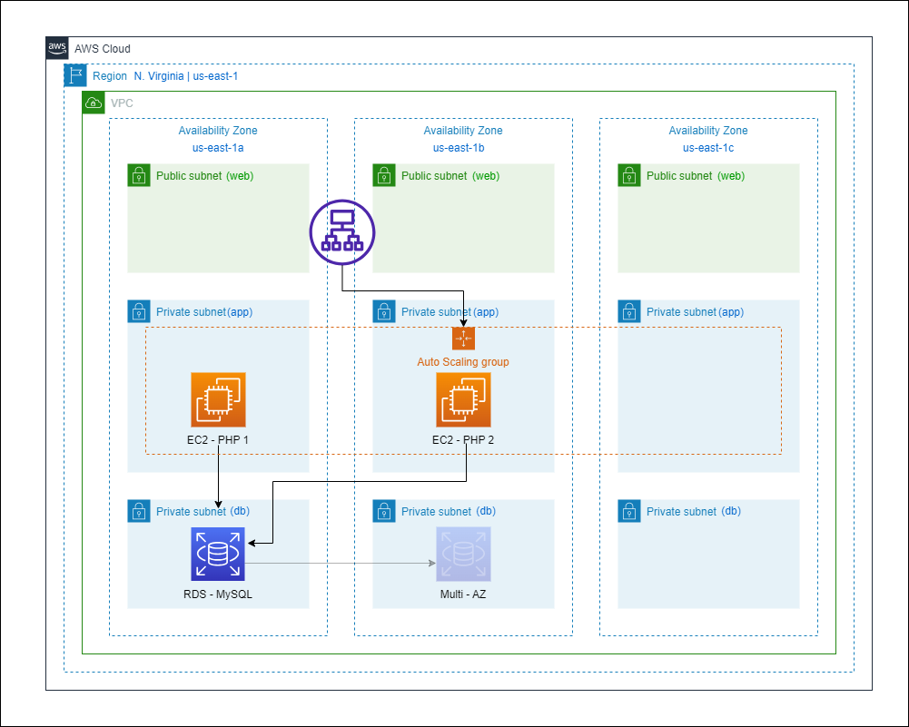

AWS Simple 3-Tier Web Architecture Infrastructure As A Code(IAC) Using Terraform
-----

This project contains IaC Infrastructure modules to provision a simple 3 tier web applucation architecture in AWS.

## 3-Tier AWS Architecture




## Requirements

| Name | Version |
|------|---------|
| <a name="requirement_aws"></a> [aws](#requirement\_aws) | ~> 4.0 |

## Install Terraform

[Terraform Installation Guide](https://learn.hashicorp.com/tutorials/terraform/install-cli)

## Providers

| Name | Version |
|------|---------|
| <a name="provider_aws"></a> [aws](#provider\_aws) | 4.57.1 |

## Modules

| Name | Source | Version |
|------|--------|---------|
| <a name="module_alb"></a> [alb](#module\_alb) | terraform-aws-modules/alb/aws | n/a |
| <a name="module_asg"></a> [asg](#module\_asg) | terraform-aws-modules/autoscaling/aws | n/a |
| <a name="module_db"></a> [db](#module\_db) | terraform-aws-modules/rds/aws | n/a |
| <a name="module_vpc"></a> [vpc](#module\_vpc) | terraform-aws-modules/vpc/aws | n/a |

## Resources

| Name | Type |
|------|------|
| [aws_autoscaling_attachment.asg_attachment_elb](https://registry.terraform.io/providers/hashicorp/aws/latest/docs/resources/autoscaling_attachment) | resource |
| [aws_security_group.example-alb-sg](https://registry.terraform.io/providers/hashicorp/aws/latest/docs/resources/security_group) | resource |
| [aws_security_group.example-app-sg](https://registry.terraform.io/providers/hashicorp/aws/latest/docs/resources/security_group) | resource |
| [aws_security_group.example-db-sg](https://registry.terraform.io/providers/hashicorp/aws/latest/docs/resources/security_group) | resource |
| [aws_vpc_security_group_ingress_rule.example-app-sg](https://registry.terraform.io/providers/hashicorp/aws/latest/docs/resources/vpc_security_group_ingress_rule) | resource |
| [aws_vpc_security_group_ingress_rule.example-db-sg](https://registry.terraform.io/providers/hashicorp/aws/latest/docs/resources/vpc_security_group_ingress_rule) | resource |
| [aws_ami.ami_id](https://registry.terraform.io/providers/hashicorp/aws/latest/docs/data-sources/ami) | data source |

## Inputs

| Name | Description | Type | Default | Required |
|------|-------------|------|---------|:--------:|
| <a name="input_database_name"></a> [database\_name](#input\_database\_name) | Name of the database | `string` | n/a | yes |
| <a name="input_database_subnets"></a> [database\_subnets](#input\_database\_subnets) | List of database subnet CIDR blocks | `list(string)` | n/a | yes |
| <a name="input_inst_type"></a> [inst\_type](#input\_inst\_type) | Type of EC2 Instance | `string` | `"t2.micro"` | no |
| <a name="input_password"></a> [password](#input\_password) | PhpMyAdmin login credentials Password | `string` | n/a | yes |
| <a name="input_private_subnets"></a> [private\_subnets](#input\_private\_subnets) | List of private subnet CIDR blocks | `list(string)` | n/a | yes |
| <a name="input_public_subnets"></a> [public\_subnets](#input\_public\_subnets) | List of public subnet CIDR blocks | `list(string)` | n/a | yes |
| <a name="input_region"></a> [region](#input\_region) | Region of VPC | `string` | n/a | yes |
| <a name="input_username"></a> [username](#input\_username) | PhpMyAdmin login credentials Username | `string` | n/a | yes |

## Outputs

| Name | Description |
|------|-------------|
| <a name="output_database_subnets"></a> [database\_subnets](#output\_database\_subnets) | VPC database private subnets' IDs list |
| <a name="output_private_subnets"></a> [private\_subnets](#output\_private\_subnets) | VPC private subnets' IDs list |
| <a name="output_public_subnets"></a> [public\_subnets](#output\_public\_subnets) | VPC public subnets' IDs list |
| <a name="output_rds-output"></a> [rds-output](#output\_rds-output) | RDS database instance endpoint |
| <a name="output_vpc_id"></a> [vpc\_id](#output\_vpc\_id) | VPC ID |


## Terraform Docs

[Terraform docs](https://github.com/terraform-docs/terraform-docs) is a utility to generate documentation from terraform modules in various output formats.

macOS users can install using Homebrew:

```
brew install terraform-docs
```

To generate terraform documentation for a module, run the following command:

```
terraform-docs markdown .
```

## Terraform Best Practices Guidelines

Following links provides generic guidelines

[terraform-best-practices.com](https://www.terraform-best-practices.com/naming) <br/>